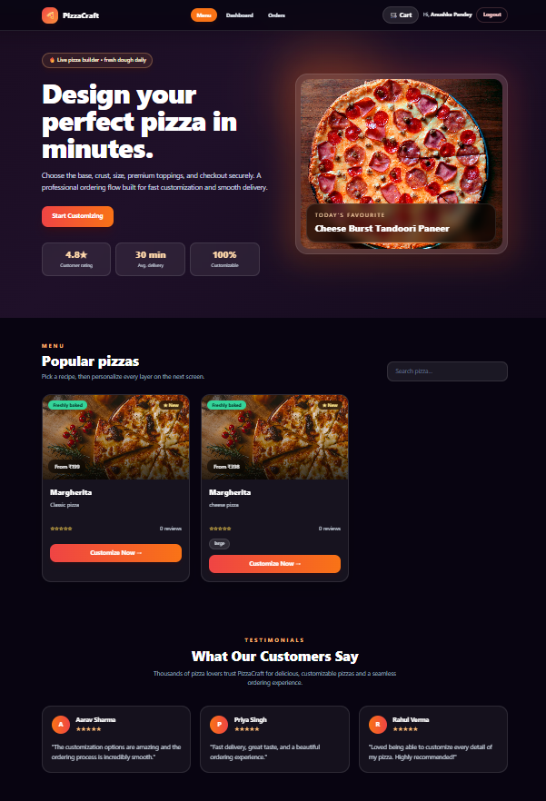
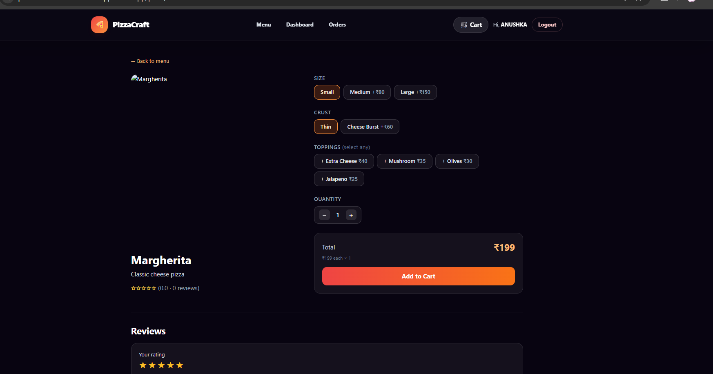
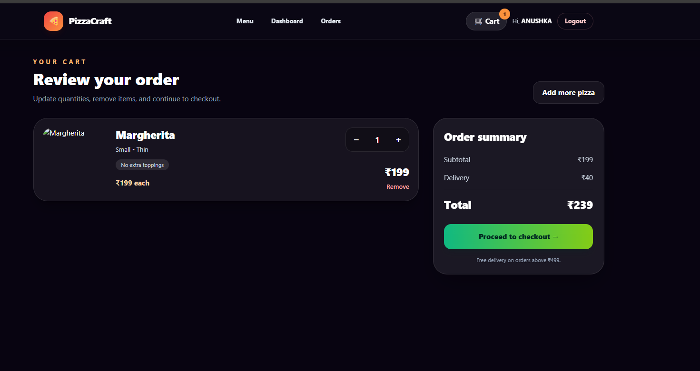
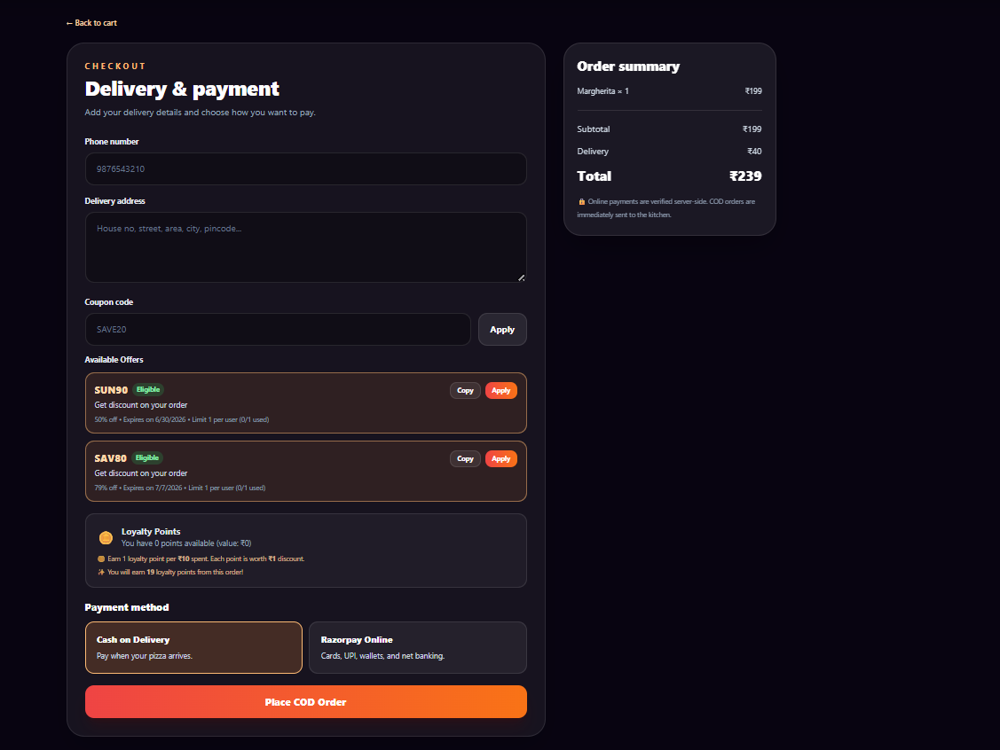
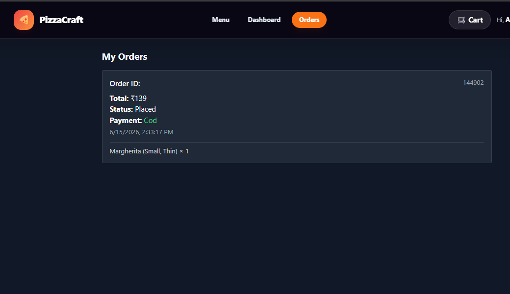
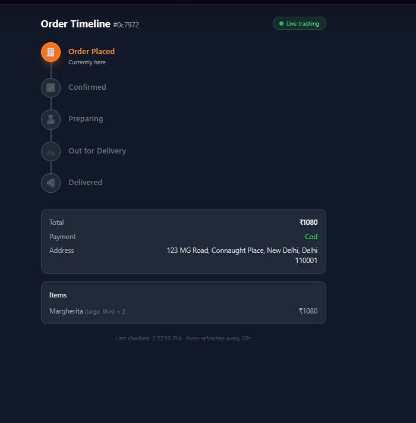
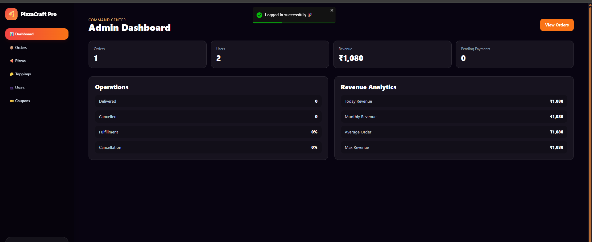

# 🍕 Pizza Customization E-Commerce Web App

A full-stack MERN based pizza ordering platform that allows users to customize pizzas, manage carts, place orders, make secure payments using Razorpay, and track order status in real time. Includes a powerful admin dashboard for managing products, orders, users, and analytics.

---

## 🌟 Features

### 👤 User Features

* User authentication (JWT)
* Browse pizza catalog
* Customize pizza (size, crust, toppings)
* Add to cart & manage cart
* Checkout with Razorpay payment gateway
* View order history & live order timeline
* Profile management
* Address book
* Wishlist
* Notifications panel
* Download invoices
* Dark/Light mode support

### 🛠 Admin Features

* Admin authentication & role protection
* Dashboard with analytics (orders, revenue, users, pending payments)
* Manage pizzas (CRUD)
* Manage toppings (CRUD)
* Manage orders & update order status
* Manage users
* Invoice generation
* Payment monitoring

---

## 🧱 Tech Stack

### Frontend

* React (Vite)
* Redux Toolkit
* React Router
* Tailwind CSS
* Axios

### Backend

* Node.js
* Express.js
* MongoDB (Mongoose)
* JWT Authentication
* Razorpay API
* Nodemailer (email notifications)

---

## 📸 Screenshots

### 🏠 Home Page


### 🍕 Pizza Customization


### 🛒 Cart


### 💳 Checkout


### 📦 Order History


### 🔴 Live Order Timeline


### 🛠 Admin Dashboard


---

## 📁 Project Structure

```
frontend/
 ├── src/
 │   ├── components/
 │   ├── layouts/
 │   ├── user/
 │   ├── admin/
 │   ├── features/
 │   ├── api/
 │   └── main.jsx

backend/
 ├── controllers/
 ├── models/
 ├── routes/
 ├── middleware/
 ├── utils/
 ├── config/
 └── server.js
```

---

## ⚙️ Environment Variables

Create `.env` in the `backend/` folder:

```env
PORT=5000
MONGO_URI=your_mongodb_connection_string
JWT_SECRET=your_secret_key

RAZORPAY_KEY_ID=rzp_test_xxxxx
RAZORPAY_KEY_SECRET=xxxxxxxx

EMAIL_HOST=smtp.gmail.com
EMAIL_PORT=587
EMAIL_USER=your_email@gmail.com
EMAIL_PASS=your_email_password
```

---

## 🚀 Installation & Setup

### 1️⃣ Clone the repository

```bash
git clone https://github.com/ankitsunil530/Pizza-Customization-Web-App.git
cd Pizza-Customization-Web-App
```

### 2️⃣ Backend setup

```bash
cd backend
npm install
npm run dev
```

### 3️⃣ Frontend setup

```bash
cd frontend
npm install
npm run dev
```

---

## 🔐 Default Roles

| Role  | Access                    |
| ----- | ------------------------- |
| User  | Shopping, orders, profile |
| Admin | Full management dashboard |

To promote a user to admin:

```js
db.users.updateOne({ email: "admin@email.com" }, { $set: { role: "admin" } })
```

---

## 💳 Razorpay Test Payment

### Test Cards

```
Card: 4111 1111 1111 1111
Expiry: 12/26
CVV: 123
OTP: 123456
```

### UPI

```
success@razorpay
```

---

## 🛡 Security

* JWT based authentication
* Role based route protection
* Secure payment verification
* Password hashing using bcrypt
* API request validation

---

## 📊 Future Enhancements

* Push notifications
* Mobile app version
* Multi-vendor support
* Cloud image storage
* AI recommendation engine

---

## 🧑‍💻 Author

**Sunil Kumar**  
Full Stack Developer (MERN)  
GitHub: [https://github.com/ankitsunil530](https://github.com/ankitsunil530)

---

## 📜 License

This project is licensed under the MIT License.

---

## ⭐ Support

If you like this project, please ⭐ the repository and share it.  
For help or feature requests, open an issue.